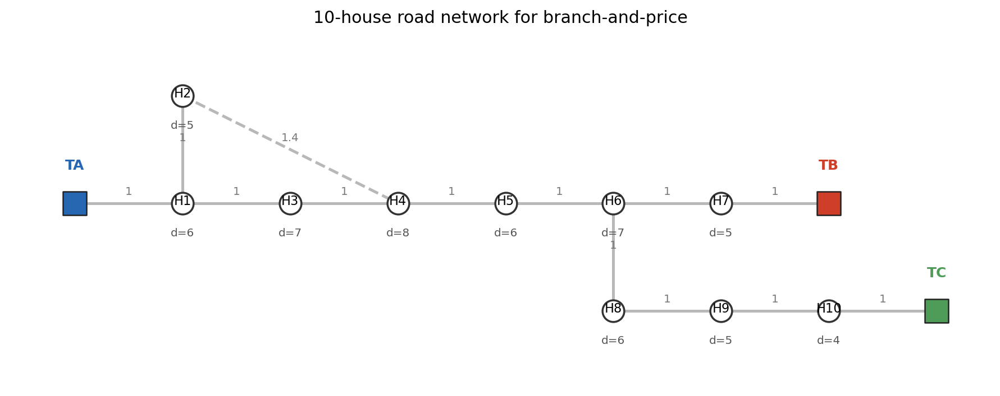

# 00 Case data

这个算例把低压配网 planning 简化成“房子通过道路分配给变压器供电”。道路网络有 10 栋房子、3 台变压器，`H2-H4` 是一条捷径边，用来制造一个有教学价值的 LP 分数解。

## Houses

| house | load | x | y |
| --- | --- | --- | --- |
| H1 | 6 | 0.0 | 0.0 |
| H2 | 5 | 0.0 | 1.0 |
| H3 | 7 | 1.0 | 0.0 |
| H4 | 8 | 2.0 | 0.0 |
| H5 | 6 | 3.0 | 0.0 |
| H6 | 7 | 4.0 | 0.0 |
| H7 | 5 | 5.0 | 0.0 |
| H8 | 6 | 4.0 | -1.0 |
| H9 | 5 | 5.0 | -1.0 |
| H10 | 4 | 6.0 | -1.0 |

## Roads

| from | to | length | kind |
| --- | --- | --- | --- |
| A | 1 | 1.0 | main |
| 1 | 2 | 1.0 | main |
| 1 | 3 | 1.0 | main |
| 3 | 4 | 1.0 | main |
| 4 | 5 | 1.0 | main |
| 5 | 6 | 1.0 | main |
| 6 | 7 | 1.0 | main |
| 7 | B | 1.0 | main |
| 6 | 8 | 1.0 | main |
| 8 | 9 | 1.0 | main |
| 9 | 10 | 1.0 | main |
| 10 | C | 1.0 | main |
| 2 | 4 | 1.4 | shortcut |

## Column 的数学含义

一个 column 是某台变压器 $t$ 的一个供电区域 $S$。它不是单个建筑分配变量，而是一整个可行供电方案。

$$
x_{tp}=1
$$

表示变压器 $t$ 选择 column $p$，也就是服务该 column 中的房子集合 $S_p$。

可行性条件为：

$$
\sum_{i\in S_p} d_i \le C_t
$$

$$
S_p \text{ 在道路诱导子图中连通}
$$

$$
\max_{i\in S_p} \Delta V_i(S_p,t) \le 0.12
$$

这里的电压降是教学用代理量，不是完整潮流：

$$
\Delta V_i(S,t)=\alpha\sum_{e\in path(t,i)} l_e D_e(S)
$$

其中 $D_e(S)$ 是经过道路边 $e$ 的下游负荷，$\alpha=0.001$。

column 成本为：

$$
c_t(S)=5+0.2L_t(S)+0.05\sum_{i\in S}d_i\operatorname{dist}_{ti}
$$

空 column 允许存在，表示该变压器本轮不服务任何房子，成本为 0。
