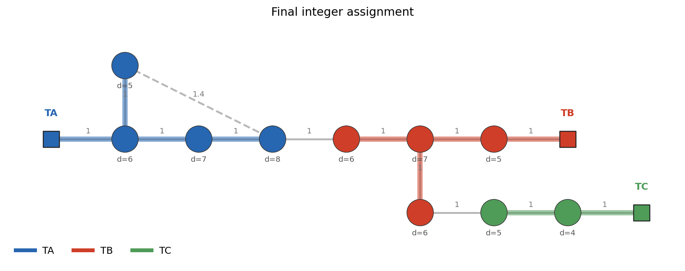

# 04 Final solution

最终整数规划方案如下。

| t | column | houses | load | length | drop | cost |
| --- | --- | --- | --- | --- | --- | --- |
| A | C033 | H1,H2,H3,H4 | 26 | 4.00 | 0.0490 | 8.50 |
| B | C081 | H5,H6,H7,H8 | 24 | 4.00 | 0.0490 | 8.55 |
| C | C107 | H9,H10 | 9 | 2.00 | 0.0140 | 6.10 |

总成本：

$$
23.1500
$$

全列 MIP 校验目标值：

$$
23.1500
$$

两者一致，说明 branch-and-price 得到的整数解与枚举全部 columns 后直接求 MIP 的结果一致。本算例存在多个并列最优解；这里报告与初始分区一致、也更容易从图上阅读的一组 incumbent。

## 学习要点

1. column 是一整个变压器供电区域，不是单个 $y_{it}$。
2. RMP 的对偶变量 $\pi_i$ 告诉 pricing：当前哪些房子“值得覆盖”。
3. reduced cost 小于 0 表示新 column 能改善当前 LP。
4. root LP 目标值 **22.4433** 是整数问题的下界，但分数解不能直接作为规划方案。
5. branch 条件要能被 pricing 理解，否则子节点无法正确生成 columns。

